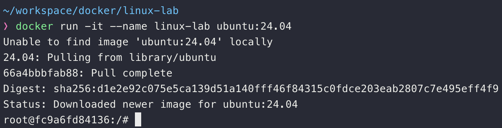

# 🌱 1.  리눅스란 무엇인가? 

## 🎯 목표

리눅스의 기본 철학과 역사, 구조 이해하기

## 🧩 개요

- **리눅스(Linux)** 는 **Unix 계열** 운영체제(OS)의 한 종류입니다.→ “오픈소스”, “**무료**”, “**서버 환경의 표준**”이 핵심 키워드입니다.
- **커널(Kernel)** : 운영체제의 핵심. 하드웨어와 소프트웨어를 연결
- **배포판(Distro)** : Ubuntu, CentOS, Debian, Fedora 등
- **CLI vs GUI** : 리눅스는 기본적으로 명령어 중심 (Command Line Interface)

### 📌 리눅스가 많이 쓰이는 이유

| 분야  | 사용 예시 |
| --- | --- |
| 서버  | AWS EC2, GCP VM, Naver Cloud VM |
| 데이터 엔지니어링 | Airflow, Spark, Hadoop |
| 머신러닝/AI | 모델 학습 서버, Docker 컨테이너 |
| 임베디드 | **Android**, Raspberry Pi 등 |

### 

* * *

## 🧩 1️⃣ Docker Desktop 설치

#### 💻 macOS (Intel / M1 / M2)

1. Docker Desktop 다운로드👉 [https://www.docker.com/products/docker-desktop/](https://www.docker.com/products/docker-desktop/)
2. Apple Silicon(M1/M2) 사용자는 ARM 버전 자동 인식됨
3. 설치 후 실행 → Docker 아이콘이 메뉴바에 표시되면 정상 구동

#### 💻 Windows 10 / 11

1. **WSL2 활성화 및 Docker Desktop 설치**

```powershell
wsl --install
```
2. Docker Desktop for Windows 다운로드👉 [https://www.docker.com/products/docker-desktop/](https://www.docker.com/products/docker-desktop/)
3. 실행 후 “Use the WSL 2 based engine” 옵션 체크

> ⚠️ 설치 후 재부팅 필수입니다.  
> Docker가 실행 중일 때만 컨테이너 명령어가 동작합니다.

* * *

## 🧩 2️⃣ Ubuntu 컨테이너 실행하기

Docker가 실행 중인 상태에서 터미널(또는 PowerShell)을 열고 아래 명령어를 입력합니다:

```bash
docker run -it --name linux-lab ubuntu:24.04
```

- `-it`: 인터랙티브 모드로 터미널 연결
- `--name linux-lab`: 컨테이너 이름 지정
- `ubuntu:24.04`: Ubuntu 24.04 LTS 이미지 사용

> 🧩 실행 후 프롬프트가 `root@xxxx:/#` 형태로 바뀌면 성공입니다.  
> 이 환경이 바로 리눅스 실습용 Ubuntu입니다.



* * *

## 🧩 3️⃣ 기본 패키지 설치 (한 번만 실행)

컨테이너 안에서 아래 명령어 입력:

```bash
apt update && apt install -y vim curl wget net-tools tree htop sudo
```

이러면 실습용 필수 명령어들이 설치됩니다.

> timezone 설정이 필요하면 `5`, `68` 입력  

```
Configuring tzdata
------------------

Please select the geographic area in which you live. Subsequent configuration questions will narrow this down by
presenting a list of cities, representing the time zones in which they are located.

  1. Africa   3. Antarctica  5. Asia      7. Australia  9. Indian    11. Etc
  2. America  4. Arctic      6. Atlantic  8. Europe     10. Pacific  12. Legacy
Geographic area: 5

Please select the city or region corresponding to your time zone.

  1. Aden      16. Brunei       31. Hong_Kong    46. Kuala_Lumpur  61. Pyongyang      76. Tel_Aviv
  2. Almaty    17. Chita        32. Hovd         47. Kuching       62. Qatar          77. Thimphu
  3. Amman     18. Choibalsan   33. Irkutsk      48. Kuwait        63. Qostanay       78. Tokyo
  4. Anadyr    19. Chongqing    34. Istanbul     49. Macau         64. Qyzylorda      79. Tomsk
  5. Aqtau     20. Colombo      35. Jakarta      50. Magadan       65. Riyadh         80. Ulaanbaatar
  6. Aqtobe    21. Damascus     36. Jayapura     51. Makassar      66. Sakhalin       81. Urumqi
  7. Ashgabat  22. Dhaka        37. Jerusalem    52. Manila        67. Samarkand      82. Ust-Nera
  8. Atyrau    23. Dili         38. Kabul        53. Muscat        68. Seoul          83. Vientiane
  9. Baghdad   24. Dubai        39. Kamchatka    54. Nicosia       69. Shanghai       84. Vladivostok
  10. Bahrain  25. Dushanbe     40. Karachi      55. Novokuznetsk  70. Singapore      85. Yakutsk
  11. Baku     26. Famagusta    41. Kashgar      56. Novosibirsk   71. Srednekolymsk  86. Yangon
  12. Bangkok  27. Gaza         42. Kathmandu    57. Omsk          72. Taipei         87. Yekaterinburg
  13. Barnaul  28. Harbin       43. Khandyga     58. Oral          73. Tashkent       88. Yerevan
  14. Beirut   29. Hebron       44. Kolkata      59. Phnom_Penh    74. Tbilisi
  15. Bishkek  30. Ho_Chi_Minh  45. Krasnoyarsk  60. Pontianak     75. Tehran
Time zone: 68
```

<br>

* * *

## 🧩 4️⃣ 컨테이너 재접속 / 관리 명령어

| 동작  | 명령어 |
| --- | --- |
| 실행 중 컨테이너 목록 보기 | `docker ps` |
| 중지된 컨테이너 포함 보기 | `docker ps -a` |
| 중지하기 | `docker stop linux-lab` |
| 다시 실행하기 | `docker start -ai linux-lab` |
| 삭제하기 | `docker rm linux-lab` |

* * *

## 🧩 5️⃣ Mac/Windows 폴더 공유 (선택)

Mac 혹은 Windows의 특정 폴더를 컨테이너 안에서 사용하려면:

```bash
mkdir -p ~/workspace/docker/linux-lab
docker run -it -v ~/workspace/docker/linux-lab:/root/workspace --name linux-lab ubuntu:24.04
```

- `~/workspace/docker/linux-lab` → 로컬 경로
- `/root/workspace` → 컨테이너 내부 경로

이제 로컬 파일을 바로 리눅스 환경에서 접근할 수 있습니다.

> **💡 주의 (Conflict 에러 발생 시)**
> 이미 위 명령어를 한 번 실행해서 `linux-lab` 이라는 컨테이너가 존재한다면 아래와 같은 에러가 발생합니다.
> `docker: Error response from daemon: Conflict. The container name "/linux-lab" is already in use by container "...".`
> 
> **대처 방법:**
> 1. 계속 기존 환경을 이어 쓰고 싶다면: `docker start -ai linux-lab`
> 2. 초기화하고 처음부터 다시 만들고 싶다면: `docker rm -f linux-lab` 입력 후 다시 `docker run ...` 명령어 실행

* * *

## 🧩 6️⃣ 실행 단축 명령어 등록 (선택)

매번 명령어를 길게 입력하지 않기 위해 alias를 등록합니다.

```bash
echo "alias linuxlab='docker start -ai linux-lab'" >> ~/.zshrc
source ~/.zshrc
```

이제 터미널에서 단순히 `linuxlab` 입력 시 바로 리눅스 컨테이너로 접속됩니다 🚀

* * *

## 🧩 실습 환경 요약

| 항목  | 내용  |
| --- | --- |
| 실행 OS | Ubuntu 24.04 LTS (Docker 기반) |
| 설치 도구 | Docker Desktop (Windows/macOS 공통) |
| 접속 방법 | `docker run -it ubuntu:24.04` |
| 장점  | 빠름 ⚡, 가볍고 복원 쉬움, OS 상관없이 동일 환경 |
| 단점  | CLI 환경만 제공 (그래픽 데스크탑 없음) |

* * *

## 🧩 로컬 디렉토리 구조

```
~/workspace/
├── repo/
│   └── linux-lab/                 ← git clone 으로 받은 강의 자료 저장소
│       ├── 01_intro.md
│       ├── 02_basic.md
│       ├── 03_vim_basic.md
│       ├── 04_vim_advanced.md
│       ├── 05_file_dir.md
│       ├── 06_network_script.md
│       ├── 07_script_advanced.md
│       ├── 08_permission_process.md
│       ├── 09_practical_cmd.md
│       ├── 10_reference.md
│       └── qna/                   ← 실습 정답 파일 모음
└── docker/
    └── linux-lab/                 ← 볼륨 마운트 경로 (컨테이너 /root/workspace 와 동기화)
```

* * *

## 🧩 실습자료 

[https://github.com/lim-dongsun/linux-lab](https://github.com/lim-dongsun/linux-lab)

```
mkdir -p ~/workspace/repo
cd ~/workspace/repo
git clone https://github.com/lim-dongsun/linux-lab.git
```